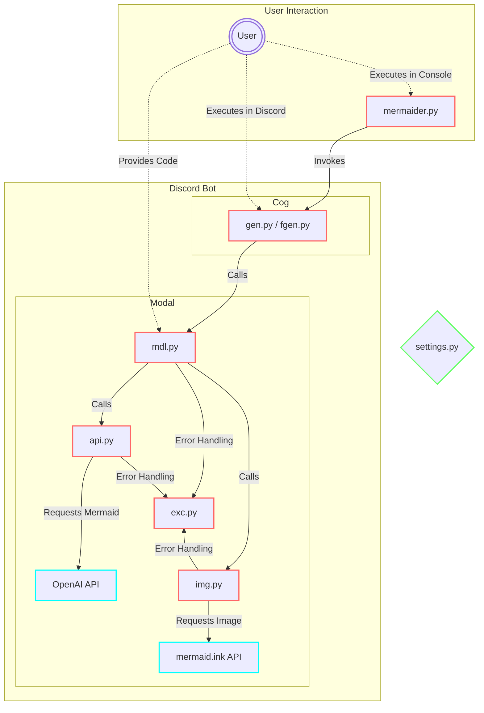
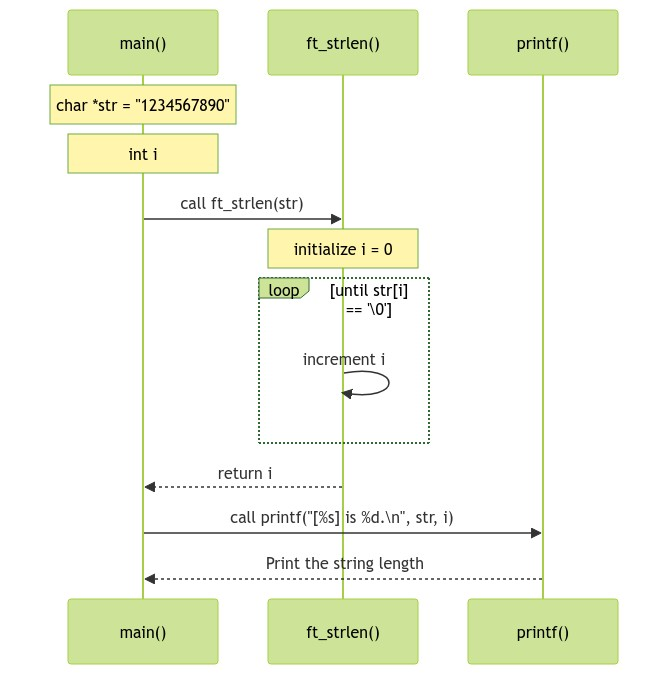
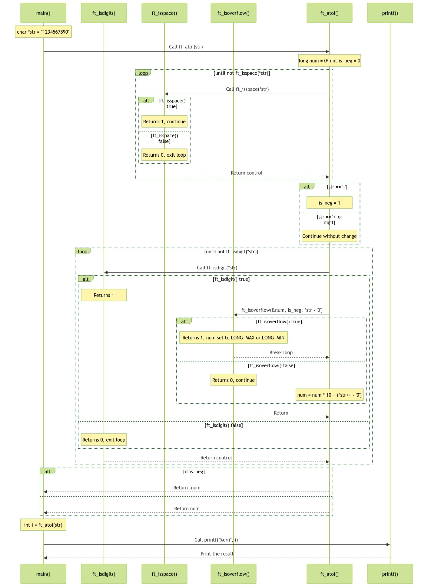

# Mermaider

<p align="center">
  
</p>

This program named “Mermaider”, is powered by OpenAI, designed as a Discord bot that processes user-provided source code inputs. It creates Mermaid diagrams from these inputs and uses the mermaid.ink REST API for converting these diagrams into images. The primary aim is to enable easy visualization of code structures and logic in a graphical format through Discord, enhancing user understanding and interaction. This discord bot developed for research purpose.

Note: This program includes some icons that is distributed in the [Apache License 2.0](https://www.apache.org/licenses/LICENSE-2.0).

---

## Key Feature

- Processing of source code input via Discord bot commands.
- Interaction with `OpenAI API` to generate Mermaid syntax from source code.
- Use of `mermaid.ink API` to create visual representations of the generated Mermaid diagrams.

## Technology and Library

- Python 3.8 or later version: For the overall development of the bot.
- `discord.py`: A Python library for Discord API integration.
- `OpenAI API`: To leverage AI-powered code analysis and diagram generation.
- `mermaid.ink API`: An online tool to render Mermaid syntax diagrams as images.
- Additional libraries like `furl` for URL manipulation, `requests` for HTTP request, and `dotenv` for managing environment variables.

## Structure

- The program includes modules for handling different tasks:
  - `api.py`: Manages interactions with the `OpenAI API`.
  - `img.py`: Handles the conversion of Mermaid syntax to images using `mermaid.ink API`.
  - `mdl.py`: Manages data models and structures used within the program.
- Configuration files such as `.env` and `loggerConfig.json` are utilized for setting up environment variables and logging.

## Installation Guide

### Prerequisites

- Python 3.8 or higher.
- A Discord account and bot token.
- An `OpenAI API` key.

### Library Installation

Install the necessary Python libraries:

```bash
# for macos or linux...
pip3 install openai furl python-dotenv requests
python3 -m pip install -U discord.py
```

### Environment Variables

Create a `.env` file in the project's `mSettings` directory and configure it as follows:

```bash
DISCORD_BOT_TOKEN=your_discord_bot_token
DISCORD_SERVER_ID=your_discord_server_id
OPENAI_API_KEY=your_openai_api_key
```

Please check [discord.py official document](https://discordpy.readthedocs.io/ja/latest/discord.html) for information on how to initially set up the discord bot and how to add it to the server.

## Running the Program

To start the program, run the following command in the root directory:

```bash
python3 mermaider.py
```

## How To Use Bot

On the server where you added this bot, you can run the following 2 commands:

```bash
# generate diagram which visualizes your C code (Powered by GPT-3.5)
/gen

# generate diagram which visualizes your code (Powered by GPT-4)
/fgen
```

---

## Graph



---

> [!IMPORTANT]
> In the [tests](./_tests) directory, you can see the test results of the prompts included in this program.

## Sample

```cpp
#include <stdio.h>

size_t	ft_strlen(const char *str)
{
	size_t	i;

	i = 0;
	while (str[i] != '\0')
		i++;
	return (i);
}

int main()
{
	char *str = "1234567890";
	int i = ft_strlen(str);

	printf("[%s] is %d.\n", str, i);
}

```

<p align="center">
  
</p>

---

```cpp
#include <stdio.h>
#include <limits.h>

int	ft_isdigit(int c)
{
	return ('0' <= c && c <= '9');
}

int	ft_isspace(int c)
{
	return ((9 <= c && c <= 13) || c == 32);
}

static int	ft_isoverflow(long *num, int is_neg, int c)
{
	long	cutoff;
	int		cutlim;

	if (is_neg)
	{
		cutoff = -(LONG_MIN / 10);
		cutlim = -(LONG_MIN % 10);
	}
	else
	{
		cutoff = LONG_MAX / 10;
		cutlim = LONG_MAX % 10;
	}
	if (*num > cutoff || (*num == cutoff && c > cutlim))
	{
		if (is_neg)
			*num = LONG_MIN;
		else
			*num = LONG_MAX;
		return (1);
	}
	return (0);
}

int	ft_atoi(const char *str)
{
	long	num;
	int		is_neg;

	num = 0;
	is_neg = 0;
	while (ft_isspace(*str))
		str++;
	if (*str == '-')
		is_neg = 1;
	if (*str == '-' || *str == '+')
		str++;
	while (ft_isdigit(*str))
	{
		if (ft_isoverflow(&num, is_neg, *str - '0'))
			break ;
		num = num * 10 + (*str++ - '0');
	}
	if (is_neg)
		return (-num);
	return (num);
}

int main()
{
	char *str = "1234567890";
	int i = ft_atoi(str);

	printf("%d\n", i);
}

```

<p align="center">
  
</p>
