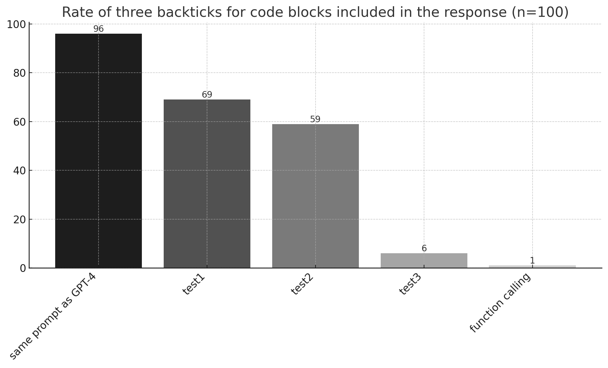
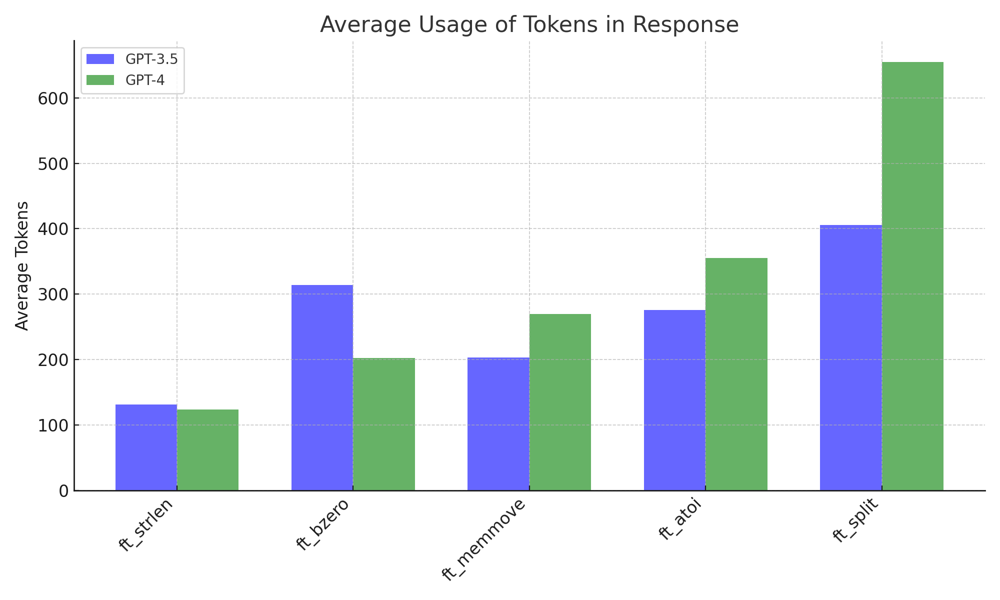

# function calling vs three backticks

This is a log of the prompt performance testing for the development of Mermaider.</br>In my opinion, it is difficult to keep the quality of the **GPT-3.5** model responses using just the _Few Shot_ technique and other prompt engineering (it worked well on **GPT-4**).</br>One discovery in testing is that _function calling_ is effective in removing backticks from **GPT-3.5** output.

## Result



- The test runs 10 C code inputs to **GPT-3.5** and checks the outputs.

- Comparing Test2 and Test3 shows that negative prompts are effective at some point.

- Plus, _function calling_ is awesome!

However, this behavior is not what is originally expected.
Even though the prompt's _Few-Shot_ example requests **GPT-3.5** to respond with the following parameters:

```
{"role": "assistant", "content": "<response message>"}
```

By using _function calling_, models must respond with a different parameters:

```
{'role': 'assistant',
  'content': None,
  'tool_calls': [{'id': 'id',
    'type': 'function',
    'function': {'name': 'funcname',
     'arguments': '{\n  "arg_1": "Chat",\n  "arg_2": "GPT-",\n  "arg_3": 4\n}'}}]}
```

So, it's weird.

---

In the performance test, backticks appeared just 3 times out of 500 runs (only applied the _function calling_ to **GPT-3.5**).




---

> [!NOTE]
> _All the graphs were created with ChatGPT._

## How to use the tester

### Library Installation

```
pip3 install openai furl python-dotenv requests coloredlogs verboselogs enlighten openpyxl
```

### Environment Variable

```bash
OPENAI_API_KEY=your_openai_api_key
```

> [!IMPORTANT]
> You can see the **prompt.json** in `data/input/` and edit as you like.</br>
> When you edit the prompt,include the **GPT-3.5** or **GPT-4** string in the json key.

```bash
# for single input (source: data/input/code/*) test.
python3 singleTester.py [file_name] [count]

# for multi input (source: input/*.json) test.
python3 multiTester.py [file_name] [count]
```

> [!WARNING]
> Pay attention to the API usage fees.

## How to use the input generator

The source files in `data/input/code/` directory are converted to json.
You can make error input using generator.py. Since it is just a random combination of sentences, edit generator.py if necessary.

```bash
python3 generator.py [file_name] [1: for_valid_input, 0: for_error_input]
```
