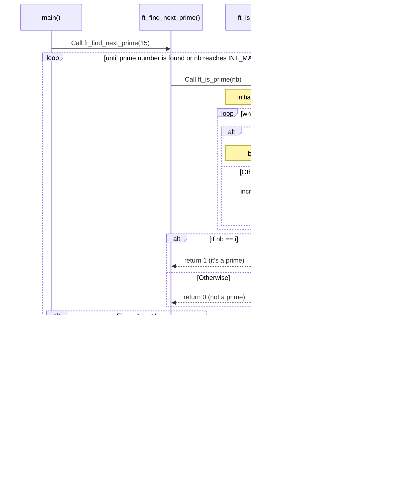

```mermaid
sequenceDiagram
participant M as main()
participant FNP as ft_find_next_prime()
participant FIP as ft_is_prime()
participant PF as printf()
M->>FNP: Call ft_find_next_prime(15)
loop until prime number is found or nb reaches INT_MAX
    FNP->>FIP: Call ft_is_prime(nb)
    note over FIP: initialize i = 2
    loop while nb % i != 0
        alt if i > nb
            note over FIP: break
        else Otherwise
            FIP->>FIP: increment i
        end
    end
    alt if nb == i
        FIP-->>FNP: return 1 (it's a prime)
    else Otherwise
        FIP-->>FNP: return 0 (not a prime)
    end
    alt if result == 1
    FNP-->>M: Return next prime number after 15
    else Otherwise
    FNP->>FNP: increment nb
    end
end
M->>PF: call printf("%d\n", ft_find_next_prime(15))
PF-->>M: Print the result
```
