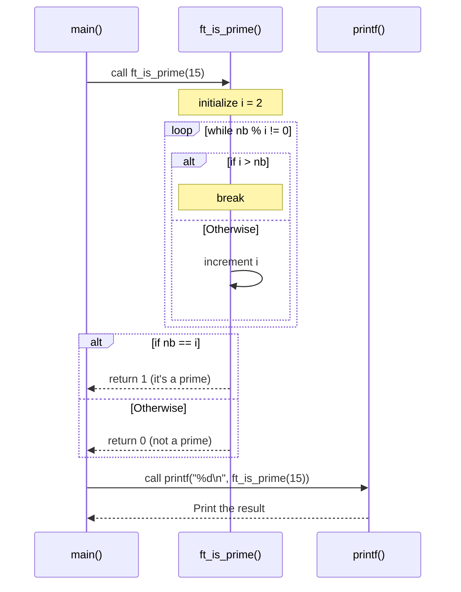

```mermaid
sequenceDiagram
participant M as main()
participant FIP as ft_is_prime()
participant PF as printf()
M->>FIP: call ft_is_prime(15)
note over FIP: initialize i = 2
loop while nb % i != 0
    alt if i > nb
        note over FIP: break
    else Otherwise
        FIP->>FIP: increment i
    end
end
alt if nb == i
    FIP-->>M: return 1 (it's a prime)
else Otherwise
    FIP-->>M: return 0 (not a prime)
end
M->>PF: call printf("%d\n", ft_is_prime(15))
PF-->>M: Print the result
```
